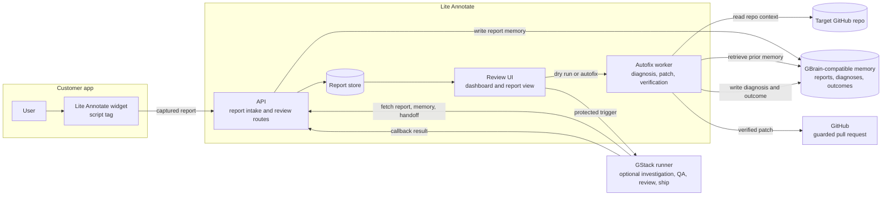

# Lite Annotate

Lite Annotate turns in-product bug reports into engineering-ready work. Setup is one config block and one async script tag; no app package, framework adapter, build plugin, or SDK call is required for the capture path.

A small browser widget captures the user's report together with the technical context engineers usually have to reconstruct: route, browser metadata, console errors, network breadcrumbs, session breadcrumbs, selected element context, and screenshot status.

The backend stores each report as durable engineering memory, retrieves related prior context, runs repo-aware diagnosis, generates a scoped patch when the evidence supports it, verifies the patch locally, and can open a guarded GitHub pull request.

```text
user report
  -> browser evidence
  -> durable memory
  -> repo-aware diagnosis
  -> scoped patch
  -> local verification
  -> guarded pull request
```

## Why It Exists

Most customer bug reports are not actionable on arrival. They describe what felt broken, but they rarely include the route, browser state, console failure, network request, prior incidents, likely source file, or verification path.

Lite Annotate makes that handoff explicit. Each report becomes a structured engineering artifact with receipts:

- **Capture:** the widget records annotation text, route, browser metadata, console errors, network breadcrumbs, session breadcrumbs, selected element context, and screenshot status.
- **Memory:** reports, diagnoses, and outcomes are written to GBrain-compatible memory so future investigations start with prior context.
- **Diagnosis:** the worker ranks candidate files and explains the likely root cause with browser, memory, and code evidence before attempting a patch.
- **Verification:** generated patches are constrained to diagnosed target files and checked in a temporary workspace before any PR action.
- **Review:** report views expose memory impact, cold-agent versus memory-assisted comparison, verification output, and handoff payloads for engineering review.

## Setup in Minutes

Add the widget config and hosted script to any browser-based web app:

```html
<script>
  window.ANNOTATE_API_URL = "https://lite-annotate.example.com";
  window.ANNOTATE_PROJECT_ID = "my-app";
  window.ANNOTATE_REPO = "owner/repo";
</script>
<script async src="https://lite-annotate.example.com/widget.js"></script>
```

That is the customer-app integration. `ANNOTATE_REPO` connects each report to the GitHub repository Lite Annotate should analyze, while the widget itself runs outside the app bundle.

Fast capture path:

1. Paste the config block and script tag.
2. Set `ANNOTATE_API_URL`, `ANNOTATE_PROJECT_ID`, and `ANNOTATE_REPO`.
3. Open the app and submit a report from the widget.
4. Review captured reports at `/reports/dashboard` or `/reports/:id/view`.

Repo-aware analysis is the next step:

1. Run dry-run analysis with `POST /reports/:id/autofix?dryRun=1`.
2. Add GitHub credentials only when private repo access or verified PR creation is desired.
3. Use `POST /reports/:id/autofix` for the full gated PR path.

Dry-run analysis is the default review path. It exercises diagnosis and verification without opening a public branch or pull request.

## Architecture



The capture path only needs the widget and Lite Annotate API. GBrain adds durable report, diagnosis, and outcome memory. GStack is optional; it runs protected investigation or review jobs from the report page and returns structured results through the callback path.

## Product Surface

| Surface | Purpose |
| --- | --- |
| `GET /widget.js` | Hosted browser widget script. |
| `GET /demo` | Local validation page for the capture flow. |
| `POST /report` | Report intake endpoint. |
| `GET /reports` | JSON list of saved reports. |
| `GET /reports/dashboard` | Review queue for captured reports. |
| `GET /reports/:id/view` | Human-readable report detail with memory, diagnosis, and verification context. |
| `GET /reports/:id/handoff` | Structured handoff payload for downstream agents or review tooling. |
| `GET /reports/:id/memory` | Similar memory, memory impact, and receipt trail. |
| `POST /reports/:id/autofix?dryRun=1` | Diagnosis and verification without PR creation. |
| `POST /reports/:id/autofix` | Full autofix path with guarded PR creation when credentials and gates allow it. |
| `POST /reports/:id/gstack/investigate` | Optional protected GStack investigation trigger. |

## How the Pipeline Works

1. **Normalize the report.** `POST /report` validates and normalizes the widget payload into the `LiteReport` contract.
2. **Persist report and memory.** Reports are stored locally, with GBrain HTTP memory used when configured and markdown memory as a fallback.
3. **Build repo context.** The worker clones or opens the target repo, indexes JavaScript and TypeScript files, and ranks likely candidates from route, stack, symbol, annotation, and test proximity signals.
4. **Diagnose before patching.** Diagnosis records severity, root cause, evidence, target files, fix strategy, confidence, and whether a patch is justified.
5. **Generate a scoped patch.** Deterministic patching is used where available. A configured OpenAI-compatible code model can produce a bounded patch when local triage needs repo-wide file selection.
6. **Verify locally.** Patches are applied in a temporary workspace and must pass syntax checks, package-script checks when enabled, and any supplied smoke commands.
7. **Open a PR only after gates pass.** GitHub PR creation is skipped unless verification succeeds and credentials are configured.

## Current Scope

Implemented:

- Browser widget capture for annotation, console, network, session, browser, route, and screenshot fields.
- Hono API for report intake, report storage, dashboard, report detail, memory, handoff, autofix, and GStack review routes.
- GBrain-compatible memory with native HTTP integration and markdown fallback.
- JavaScript and TypeScript repo indexing with candidate ranking.
- Structured diagnosis, deterministic and model-backed patch generation, local patch verification, and guarded GitHub PR creation.
- Dry-run analysis for review without external PR actions.
- Optional protected GStack runner integration for investigation, QA, review, and ship workflows.

Not yet in scope:

- Multi-tenant auth, billing, and tenant-level administration.
- Full session replay.
- Broad non-JavaScript language support.
- Autonomous merge.
- Production-grade abuse controls, retention policies, and compliance workflows.

## Run Locally

Install dependencies:

```bash
npm install
```

Start the API:

```bash
npm run dev
```

Open:

```text
http://localhost:3001/demo
```

Run checks:

```bash
npm test
npm run typecheck
```

## Configuration

Lite Annotate runs with local report storage and markdown memory by default. These variables enable external services and stricter workflows:

```text
REPORT_STORE_DIR=<optional local report store path>
MEMORY_PROVIDER=gbrain|github-markdown
MEMORY_DIR=<optional markdown memory path>

GBRAIN_MCP_URL=https://<gbrain-service>/mcp
GBRAIN_MCP_TOKEN=<optional-static-token>
GBRAIN_CLIENT_ID=<optional-oauth-client-id>
GBRAIN_CLIENT_SECRET=<optional-oauth-client-secret>
GBRAIN_OAUTH_SCOPE="read write"

OPENAI_API_KEY=<token for model-backed patch generation>
OPENAI_BASE_URL=https://api.openai.com/v1
AUTOFIX_CODE_MODEL=gpt-5.3-codex-spark
AUTOFIX_DISABLE_LLM_PATCH=true|false
AUTOFIX_RUN_PACKAGE_SCRIPTS=true|false

GITHUB_TOKEN=<token with repo access>
GITHUB_REPO=<owner/repo used for PR creation>
TARGET_REPO=<owner/repo or URL used for repo cloning>
TARGET_REPO_BRANCH=<optional branch>
AUTOFIX_ALLOWED_REPOS=<comma-separated owner/repo allowlist for report-provided repos>
REPO_WORKSPACE_ROOT=<optional clone/cache root>

PUBLIC_BASE_URL=https://<lite-annotate-host>
GSTACK_UI_TRIGGER_ENABLED=1
GSTACK_TRIGGER_TOKEN=<product trigger token>
GSTACK_RUNNER_URL=https://<gstack-runner-host>
GSTACK_RUNNER_TOKEN=<runner token>
GSTACK_CALLBACK_TOKEN=<callback token expected by Lite Annotate>
GSTACK_CALLBACK_BASE_URL=https://<callback-host>
GSTACK_ALLOW_PR=1
```

The worker uses the target repository as the source of truth for file contents. Memory improves context and retrieval, but PR generation still depends on scoped diagnosis and local verification.
For hosted PR creation, report-provided repository values must match `AUTOFIX_ALLOWED_REPOS`, `TARGET_REPO`, or `GITHUB_REPO`; otherwise Auto-Fix fails closed instead of opening a PR against an untrusted repo.

## Documentation

- [PRODUCT.md](PRODUCT.md) - product positioning, users, tone, and boundaries.
- [DESIGN.md](DESIGN.md) - interface register and visual constraints.
- [docs/PRD.md](docs/PRD.md) - product requirements and operating constraints.
- [docs/INTEGRATION_AUDIT.md](docs/INTEGRATION_AUDIT.md) - integration effort and rollout levels.
- [docs/GSTACK_RUNNER.md](docs/GSTACK_RUNNER.md) - protected remote GStack runner setup.
- [docs/TRACKER.md](docs/TRACKER.md) - implementation status, validation notes, and commit ledger.

Historical planning notes live under `docs/` and are not required for product integration.

## Safety Model

- Do not commit API keys or tokens.
- Do not run arbitrary customer commands in the worker.
- Do not dump entire repositories into model context.
- Treat diagnosis as a required step before patching.
- Trust report-provided repositories only when they match the server-side allowlist.
- Open PRs only after scoped patch application and verification pass.
- Label fallback memory honestly when native GBrain is not configured.
